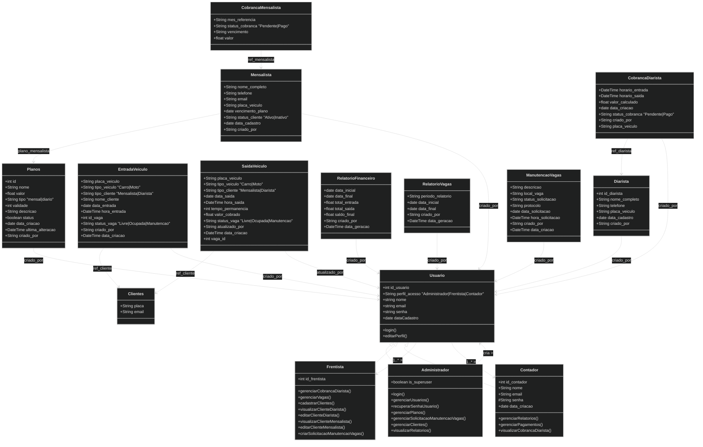

# ParkControl – Sistema de Gestão de Estacionamentos

<div align="center">
  
</div>

---

O **ParkControl** é um sistema web desenvolvido para a gestão completa de estacionamentos, oferecendo controle eficiente sobre entradas e saídas de veículos, gerenciamento de clientes, planos e relatórios financeiros. O projeto foi concebido como parte da disciplina de **Engenharia de Software (2025/01)** do IFMT.

---

## Sumário

1. [Visão Geral do Produto](#visão-geral-do-produto)  
2. [Funcionalidades Principais](#funcionalidades-principais)  
3. [Perfis de Usuário](#perfis-de-usuário)  
4. [Tecnologias Utilizadas](#tecnologias-utilizadas)  
5. [Estrutura da Documentação](#estrutura-da-documentação)  
   - [1. Concepção](#1-concepção)  
   - [2. Análise](#2-análise)
   - [3. Projeto](#3-projeto)
   - [4. Preparação do Ambiente](#4-preparação-do-ambiente)
   - [5. Implementação](#5-implementação)
   - [6. Testes](#6-testes)
   - [7. Implantação](#7-implantação)
6. [Como Executar o Projeto](#como-executar-o-projeto)  
7. [Equipe de Desenvolvimento](#equipe-de-desenvolvimento)  
8. [Licença](#licença)

---

## Visão Geral do Produto

O ParkControl foi projetado para digitalizar e automatizar processos operacionais de estacionamentos de pequeno e médio porte. Sua interface simples e recursos robustos garantem que diferentes perfis de usuários consigam operar o sistema com segurança, clareza e rapidez.

---

## Funcionalidades Principais

- Registro de **entrada e saída** de veículos
- Controle em tempo real das **vagas** (livres, ocupadas e manutenção)
- Cadastro, visualização e edição de **clientes mensalistas e diaristas**
- Geração e gestão de **cobranças** e **recibos**
- Emissão de **relatórios financeiros** e de ocupação
- **Gestão de usuários** e permissões por perfil
- Solicitação e monitoramento de **manutenções de vaga**
- Recuperação e redefinição de **senhas**
- Navegação adaptada por **perfil de acesso**

---

## Perfis de Usuário

| Perfil        | Permissões Principais |
|---------------|------------------------|
| **Administrador** | Gerencia usuários, planos, solicitações de manutenção e tem acesso total ao sistema |
| **Frentista**     | Realiza controle de entrada/saída de veículos, cadastra clientes e solicita manutenções |
| **Contador**      | Visualiza relatórios, acompanha inadimplência e realiza cobranças |
| **TI (Futuro)**   | Destinado à manutenção técnica e controle de segurança do sistema |

---

## Tecnologias Utilizadas

### Linguagens e Frameworks
- **Backend**: Python 3.11
- **Framework Web**: Django
- **Frontend**: HTML5, CSS3, Bootstrap 5

### Banco de Dados
- **Desenvolvimento**: SQLite
- **Produção (opcional)**: PostgreSQL

### Containerização e Deploy
- **Docker** + `docker-compose` – Conteinerização do ambiente
- **WSGI**: Gunicorn – Servidor de aplicações para Django
- **Nginx** – Servidor reverso para servir estáticos e balancear requisições
- **Render** – Plataforma de hospedagem utilizada para deploy automático
- **Certificado SSL Autoassinado (Debian)** – Gerado localmente via OpenSSL para uso com HTTPS durante o desenvolvimento

### Segurança e Configurações
- **Variáveis de Ambiente**: Arquivo `.env` com `python-decouple`
- **Autenticação de Usuário**: Sistema de login seguro com autenticação por perfil
- **Gerenciamento de Sessões e Senhas**: Criptografia de senhas e redefinição via e-mail

### Logs e Monitoramento
- **Logging**: Configuração de logs com níveis (`INFO`, `ERROR`, etc.) para rastreio de eventos
- **Mensagens do sistema**: Notificações via `django.contrib.messages`

### DevOps e Organização
- **Versionamento de Código**: Git + GitHub
- **Metodologia Ágil**: Scrum com controle via GitHub Projects (Kanban e Sprints)
- **CI/CD**: Deploy automático via GitHub → Render

### Modelagem e Prototipação
- **Figma** – Protótipos de telas
- **BPMN.IO** – Diagramas de processo (BPMN)
- **Lucidchart** – Casos de uso e fluxogramas
- **Mermaid.js** – Diagrama de classes em Markdown
---

## Estrutura da Documentação

A documentação completa do projeto está disponível na pasta [`/DOC`](./DOC), incluindo:

- 1 Concepção

  - Diagrama de Casos de Uso: ParkControl


  
- 2 Análise:

  - Stories e Casos de Uso - ParkControl

| Story Nº | Story | Casos de Uso |
|:--------:|:------|:-------------|
| 1 | Gerenciar Usuário | Criar Usuário <br> Visualizar Usuário <br> Editar Usuário <br> Excluir Usuário <br> Recuperar Senha de Usuário |
| 2 | Gerenciar Planos Mensalistas | Criar Plano Mensalista <br> Editar Plano Mensalista <br> Visualizar Plano Mensalista <br> Excluir Plano Mensalista |
| 3 | Gerenciar Planos Diaristas | Criar Plano Diarista <br> Editar Plano Diarista <br> Visualizar Plano Diarista <br> Excluir Plano Diarista |
| 4 | Gerenciar Solicitações de Manutenção de Vagas | Solicitar Manutenção de Vagas <br> Gerenciar Solicitações de Manutenção <br> Visualizar Solicitações Abertas <br> Encaminhar Solicitação <br> Encerrar Solicitação |
| 5 | Gerenciar Clientes Mensalistas | Visualizar Cliente Mensalista <br> Editar Cliente Mensalista <br> Excluir Cliente Mensalista |
| 6 | Gerenciar Clientes Diaristas | Visualizar Cliente Diarista <br> Editar Cliente Diarista <br> Excluir Cliente Diarista |
| 7 | Gerenciar Relatórios Financeiros | Criar Relatório <br> Editar Relatório <br> Visualizar Relatório <br> Excluir Relatório |
| 8 | Gerenciar Pagamentos | Visualizar Status de Pagamentos <br> Editar Status de Pagamento <br> Gerar Pagamentos Mensalistas <br> Enviar Cobrança Email |
| 9 | Gerenciar Cobranças de Diarista | Criar Cobrança Diarista <br> Visualizar Cobrança Diarista <br> Editar Cobrança Diarista <br> Excluir Cobrança Diarista |
| 10 | Gerenciar Vagas | Registrar Entrada de Veículo <br> Registrar Saída de Veículo <br> Visualizar Status em Tempo Real <br> Relatório de Uso de Vagas |
| 11 | Cadastrar Clientes | Cadastrar Clientes <br> Cadastrar Cliente Mensalista <br> Cadastrar Cliente Diarista |

- 3 Projeto:
    - Diagrama de Classe

  - Modelagem de Processos de Notação BPMN

 Processo Registrar a Entrada dos Veiculos


Processo de Registrar a Saida dos Veiculos


Processo de Gerenciamento de Usuarios


Processo de Recuperação de Senha


Processo de Geração de Relatorios


### Processo de Solicitação de Manunteção de Vagas


### Processo de Ativação de Plano


  - Arquitetura de Software
  ```  
parkcontrol/
│
├── apps/                        # Apps Django personalizados
│   ├── usuarios/                # Autenticação e usuários
│   ├── frentistas/             # Entrada/saída de veículos, operações do frentista
│   ├── clientes/               # Gerenciamento de clientes (mensalistas e diaristas)
│   ├── planos/                 # CRUD de planos mensais
│   ├── pagamentos/             # Cobranças e pagamentos
│   ├── manutencao/             # Solicitações e gestão de manutenção
│   ├── relatorios/             # Geração de relatórios e dashboards
│   ├── vagas/                  # Gestão de vagas
│   └── core/                   # Classes e utilitários compartilhados
│
├── base_templates/             # Templates base reutilizáveis por todo o sistema
├── templates/                  # Templates globais e específicos
├── static/                     # Arquivos estáticos (CSS, JS, imagens)
├── staticfiles/                # Pasta de coleta do `collectstatic`
│
├── parkcontrol/                # Configurações do projeto Django
│   ├── settings.py             # Configurações gerais e apps instalados
│   ├── urls.py                 # URLs principais do projeto
│   ├── wsgi.py                 # Gateway WSGI
│   └── asgi.py                 # Gateway ASGI (opcional)
│
├── nginx/                      # Configurações do servidor Nginx para deploy
├── ssl/                        # Certificados SSL e configurações HTTPS
├── logs/                       # Arquivos de log da aplicação
│
├── db.sqlite3                  # Banco de dados SQLite (para desenvolvimento)
├── manage.py                   # Comando de gerenciamento do Django
├── python/                     # Scripts auxiliares Python (opcional)
│
├── .env                        # Variáveis de ambiente (não versionar)
├── .dockerignore               # Ignorados na build Docker
├── Dockerfile                  # Build da imagem do container
├── docker-compose.yml          # Orquestração com Docker Compose
├── requirements.txt            # Dependências do projeto
├── README.md                   # Este documento
└── doc/                        # Documentação técnica (BPMN, Casos de Uso, etc.)
````
  - Protótipos de Tela

    - [Acessar Protótipo do Ator Frentista](https://www.figma.com/proto/O3luXtbTlutyw9TjPnlgeQ/Sem-t%C3%ADtulo?node-id=29-71&t=AV4GbOSADIPB2YWZ-1)
    - [Acessar Protótipo do Ator Administrador](https://www.figma.com/proto/O3luXtbTlutyw9TjPnlgeQ/Sem-t%C3%ADtulo?node-id=11-2&t=AV4GbOSADIPB2YWZ-1)
    - [Acessar Protótipo do Ator Contador](https://www.figma.com/proto/O3luXtbTlutyw9TjPnlgeQ/Sem-t%C3%ADtulo?node-id=82-1469&t=AV4GbOSADIPB2YWZ-1)

- 4 Preparação do Ambiente:
    - Esta seção detalha os passos e as configurações necessárias para configurar os ambientes de desenvolvimento e produção do ParkControl.

- 5 Implementação:
    - Esta fase abrange o desenvolvimento dos componentes de backend e frontend do sistema ParkControl.
      - Back-End: Detalha a lógica do lado do servidor, os endpoints da API e as interações com o banco de dados.
       - Front-End: Cobre o desenvolvimento da interface do usuário, scripts do lado do cliente e integração com os serviços de backend.

- 6 Testes:
  - Os testes foram desenvolvidos e executados utilizando os módulos de teste integrados do Django, presentes nos arquivos ``test.py`` de cada aplicação.
  
| App          | Tipo de Teste | Título da Task                                                         |
| :----------- | :------------ | :--------------------------------------------------------------------- |
| `usuarios`   | Back-End      | [Teste: Back-End] (app:usuarios) Validação de login com usuário válido e inválido |
| `vagas`      | Back-End      | [Teste: Back-End] Cadastro e alteração de status de vaga               |
| `frentistas` | Back-End      | [Teste: Back-End] (app:frentistas) Registro de entrada e saída de veículos |
| `clientes`   | Back-End      | [Teste: Back-End] Filtro e listagem de clientes diaristas              |
| `manutencao` | Back-End      | [Teste: Back-End] Encerramento de solicitação e atualização da vaga    |
| `relatorios` | Back-End      | [Teste: Back-End] Geração de relatório financeiro                      |
| `pagamentos` | Back-End      | [Teste: Back-End] Geração automática de cobranças para mensalistas     |
| `planos`     | Back-End      | [Teste: Back-End] Criação, edição e exclusão de planos mensais         |


- 7 Implantação:
  - A tabela a seguir detalha as tarefas essenciais relacionadas à **implantação** do ParkControl:

| Tipo de Teste/Componente | Título da Task                                                                 |
| :----------------------- | :----------------------------------------------------------------------------- |
| **Segurança / Infra** | [Implantação] Criar o certificado SSL autoassinado (OpenSSL)                   | 
| **Sistema Operacional** | [Implantação] Alterar o arquivo hosts do Windows para apontar `127.0.0.1 parkcontrol.com.br` | 
| **Infraestrutura** | [Implantação] Alterar a porta do serviço no `docker-compose.yml` (ex: de `8000:8000` para `80:8000`) |
| **Servidor Web** | [Implantação] Configurar o WSGI como proxy reverso com suporte a SSL para o Django |
| **Deploy .env** | [Implantação] Criar um arquivo `.env` de produção com `DEBUG=False`, `ALLOWED_HOSTS`, `SECRET_KEY` | 
| **Configuração Django** | [Implantação] Ajustar o Django para usar `STATIC_ROOT` e rodar `collectstatic` | 

---


## Como Executar o Projeto

> Instruções completas de instalação e execução do ambiente estão no arquivo [`README_DOCKER.md`](./README_DOCKER.md) e `docker-compose.yml`.

---

## Equipe de Desenvolvimento

| Nome             | GitHub                                       |
|------------------|----------------------------------------------|
| Emmylly Maria    | [@emmyllydev](https://github.com/emmyllydev) |
| Fábio Júnior     | [@Fabio-jr-SM](https://github.com/Fabio-jr-SM) |
| Filomena Soares  | [@filomenasoares](https://github.com/filomenasoares) |
| Pedro Lucas      | [@pedrolucasS86](https://github.com/pedrolucasS86) |

---

## Licença

Este é um projeto de caráter acadêmico, sem fins comerciais, licenciado apenas para uso educacional.

---
