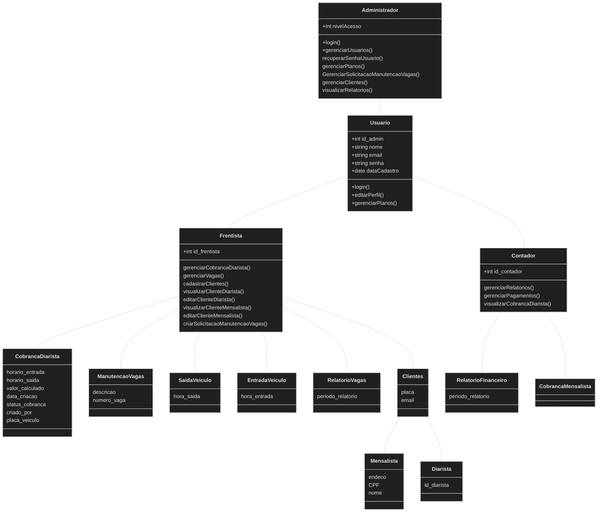

```mermaid
---
config:
  theme: dark
---
classDiagram
direction TB
    class Usuario {
	    +int id_admin
	    +string nome
	    +string email
	    +string senha
	    +date dataCadastro
	    +login()
	    +editarPerfil()
	    +gerenciarPlanos()
    }
    class Contador {
	    +int id_contador
	    gerenciarRelatorios()
	    gerenciarPagamentos()
	    visualizarCobrancaDiarista()
    }
    class Frentista {
	    +int id_frentista
	    gerenciarCobrancaDiarista()
	    gerenciarVagas()
	    cadastrarClientes()
	    visualizarClienteDiarista()
	    editarClienteDiarista()
	    visualizarClienteMensalista()
	    editarClienteMensalista()
	    criarSolicitacaoManutencaoVagas()
    }
    class CobrancaDiarista {
	    horario_entrada
	    horario_saida
	    valor_calculado
	    data_criacao
	    status_cobranca
	    criado_por
	    placa_veiculo
    }
    class ManutencaoVagas {
	    descricao
	    numero_vaga
    }
    class SaidaVeiculo {
	    hora_saida
    }
    class EntradaVeiculo {
	    hora_entrada
    }
    class RelatorioVagas {
	    periodo_relatorio
    }
    class Clientes {
	    placa
	    email
    }
    class Mensalista {
	    endeco
	    CPF
	    nome
    }
    class Diarista {
	    id_diarista
    }
    class RelatorioFinanceiro {
	    periodo_relatorio
    }
    class CobrancaMensalista {
    }
    class Administrador {
	    +int nivelAcesso
	    +login()
	    +gerenciarUsuarios()
	    recuperarSenhaUsuario()
	    gerenciarPlanos()
	    GerenciarSolicitacaoManutencaoVagas()
	    gerenciarClientes()
	    visualizarRelatorios()
    }

    Usuario -- Contador
    Usuario -- Frentista
    Frentista -- CobrancaDiarista
    Frentista -- ManutencaoVagas
    Administrador -- Usuario
    Frentista -- EntradaVeiculo
    Frentista -- SaidaVeiculo
    Frentista -- RelatorioVagas
    Frentista -- Clientes
    Clientes -- Mensalista
    Clientes -- Diarista
    Contador -- RelatorioFinanceiro
    Contador -- CobrancaMensalista

```
